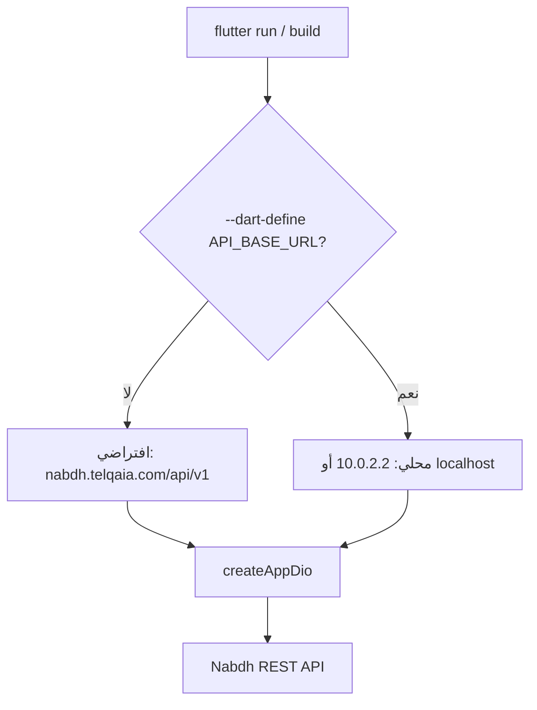

# دليل تطوير نبض اليمن (Flutter)

دليل عملي للمطورين: تشغيل المشروع، التحكم بالبيئة (محلي/إنتاج)، التشخيص، والبنية. للعقد التفصيلي للـ API راجع [`backend_guide/`](backend_guide/README.md).

---

## 1. نظرة سريعة

**نبض اليمن** تطبيق تبرع بالدم يتصل بـ REST API على `https://nabdh.telqaia.com/api/v1`. الأدوار المدعومة في التطبيق: **DONOR** (متبرع) و **CENTER** (مركز) — **لا واجهة Admin** في هذه المرحلة.

| مفهوم | المصدر |
|--------|--------|
| بيانات الأعمال (ملفات، بحث، مخزون، طلبات دم) | REST API |
| محتوى الواجهة (سلايدر، عن التطبيق، force-update) | `GET /app-config` عبر `AppConfigBloc` |
| الإشعارات | FCM فقط (`firebase_core` + `firebase_messaging`) |
| كاش المواقع | Drift (`lib/data/local/drift/`) |

### خريطة التوثيق

| السؤال | اذهب إلى |
|--------|----------|
| ماذا ننفّذ في الكود؟ (هجرة مكتملة) | [`restructure/`](restructure/README.md) + [`tasks/migration_master.md`](../tasks/migration_master.md) |
| ماذا يرسل الطلب؟ (عقد API) | [`backend_guide/`](backend_guide/README.md) |
| حالة تنفيذ السيرفر تقريباً | [`backend_docs/`](backend_docs/overview.md) |
| **تشغيل، بيئة، تشخيص** | **هذا الملف** |
| إعداد FCM على iOS | [`ios-firebase-setup.md`](ios-firebase-setup.md) |

فهرس عام: [`docs/README.md`](README.md).

---

## 2. نتيجة التدقيق (توافق المشروع مع الخطط)

**تاريخ المرجع:** مايو 2026 — بعد إكمال هجرة Firebase → REST (مراحل 0–6 في `migration_master.md`).

### متوافق مع القرارات المعمارية

| المعيار | الحالة | مرجع في الكود |
|---------|--------|----------------|
| Bloc فقط (لا Cubit) | متوافق | 7 blocs في `lib/presentation/blocs/` — لا ملفات `*cubit*` |
| لا Hive | متوافق | غير موجود في `pubspec.yaml` و `lib/` |
| Firebase للإشعارات فقط | متوافق | `firebase_core` + `firebase_messaging`؛ تهيئة في `lib/main.dart` |
| لا Admin في التطبيق | متوافق | لا مسارات/UI لـ `ADMIN` |
| DONOR + CENTER | متوافق | `lib/domain/entities/auth_session.dart`، التوجيه في `main.dart` |
| API عبر Dio + JWT refresh + `x-device-id` | متوافق | `lib/core/network/` |
| تخزين: secure + prefs + Drift | متوافق | `SessionLocalDataSource`, `PreferencesLocalDataSource`, `AppDatabase` |
| iOS + Firebase (FCM) | مُعدّ | `ios/Runner/GoogleService-Info.plist`, `lib/firebase_options.dart` — انظر [`ios-firebase-setup.md`](ios-firebase-setup.md) |

### فجوات توثيقية (ليست أخطاء في الكود)

1. بعض ملفات [`restructure/`](restructure/) (مثل `00-نظرة-عامة`, `01-طبقة-الشبكة`) تصف **حالة ما قبل الهجرة** (Cubit/Hive/Firestore) — اقرأها كتاريخ تنفيذ، وليس الوضع الحالي.
2. [`client-integration.md`](backend_guide/client-integration.md) §4 يصف `POST /auth/migration/complete` كمسار عام؛ **عميل Flutter** يستخدم OTP «نسيت كلمة المرور» فقط (انظر §8 أدناه).
3. لا **flavors** بعد — التبديل بين محلي/إنتاج عبر `--dart-define` فقط (مؤجّل اختيارياً في `restructure/README.md`).

### ديون تقنية معروفة (اختياري للتحسين لاحقاً)

- `LocalData.initialAppData` كـ fallback قبل نجاح `GET /app-config`
- `ProfileLocalData` في طبقة presentation
- `lib/core/encryption.dart` يبدو غير مستخدم
- بعض `print`/`debugPrint` متفرقة بجانب `LogInterceptor` و `AppBlocObserver`

### ما تبقى تشغيلياً

- QA يدوي ونشر المتجر: [`tasks/phase6_closure.md`](../tasks/phase6_closure.md)، [`restructure/المرحلة-6-الإغلاق/13-الاختبار-والنشر.md`](restructure/المرحلة-6-الإغلاق/13-الاختبار-والنشر.md)

---

## 3. متطلبات التطوير

| المتطلب | ملاحظة |
|---------|--------|
| Flutter SDK | متوافق مع Dart `^3.8.1` (انظر `pubspec.yaml`) |
| Android | المنصة الأساسية للتطوير اليومي |
| iOS | FCM مُعدّ — `pod install` + Push Notifications capability |
| باكإند محلي | اختياري على `http://localhost:3000/api/v1` |
| Firebase Console | مشروع `nabdh-alyaman` — للإشعارات فقط |

```bash
git clone <repo-url>
cd nabdh_alyaman
flutter pub get
```

### مفتاح Google Maps (Android — إلزامي)

المفتاح **لا يُخزَّن** في `AndroidManifest.xml`. يُقرأ عند البناء من:

1. متغير البيئة `GOOGLE_MAPS_API_KEY` (مفيد لـ CI)، أو
2. الملف المحلي `android/secrets.properties` (غير مُتتبَّع في Git).

```bash
cp android/secrets.properties.example android/secrets.properties
# عدّل GOOGLE_MAPS_API_KEY في secrets.properties
```

إذا نُسي المفتاح، **يفشل البناء فوراً** برسالة توضح الخطوات — وليس وقت التشغيل.

> **أمان:** قيّد المفتاح في Google Cloud Console (package `com.ezzcode.nabdh_alyaman` + SHA-1). إذا ظهر مفتاح قديم في Git، **أبطله/دوّره** من لوحة Google.

---

## 4. التحكم بالبيئة (محلي ↔ إنتاج)

### المصدر الوحيد اليوم

عنوان الـ API يُحدَّد **عند البناء/التشغيل** عبر `dart-define`، وليس من داخل التطبيق:

```dart
// lib/core/config/app_config.dart
static const String apiBaseUrl = String.fromEnvironment(
  'API_BASE_URL',
  defaultValue: 'https://nabdh.telqaia.com/api/v1',
);
```

| البيئة | قيمة `API_BASE_URL` |
|--------|---------------------|
| **إنتاج (افتراضي)** | `https://nabdh.telqaia.com/api/v1` |
| محلي — جهاز المضيف | `http://localhost:3000/api/v1` |
| محلي — محاكي Android | `http://10.0.2.2:3000/api/v1` |
| محلي — محاكي iOS | `http://127.0.0.1:3000/api/v1` |
| محلي — جهاز iOS فعلي على الشبكة | `http://<IP-الحاسوب>:3000/api/v1` |

> **لا trailing slash** في نهاية الـ URL.

### أمثلة أوامر

```bash
# إنتاج (افتراضي — بدون define)
flutter run

# باكإند محلي — محاكي Android
flutter run --dart-define=API_BASE_URL=http://10.0.2.2:3000/api/v1

# باكإند محلي — محاكي iOS
flutter run --dart-define=API_BASE_URL=http://127.0.0.1:3000/api/v1

# بناء إنتاج Android
flutter build appbundle --dart-define=API_BASE_URL=https://nabdh.telqaia.com/api/v1

# بناء إنتاج iOS
flutter build ios --dart-define=API_BASE_URL=https://nabdh.telqaia.com/api/v1
```

### تمييز مهم: نوعان من «الإعداد»

| الاسم في الكود | المعنى |
|----------------|--------|
| `AppConfig.apiBaseUrl` | **بيئة البناء** — أين يتصل Dio |
| `AppConfigBloc` + `GET /app-config` | **محتوى التطبيق** من السيرفر (سلايدر، عن التطبيق، إلخ) |

لا توجد **flavors** (`dev`/`prod`) ولا قائمة إعدادات مطور داخل التطبيق حالياً.



---

## 5. تشغيل المشروع

**مهم:** `flutter run -d ios` و `"deviceId": "ios"` في Cursor **لا يعملان** — استخدم المعرّف من `flutter devices` (مثل `A90B8F92-…`) أو اسم المحاكي (`iPhone 17 Pro`).

```bash
flutter devices                    # قائمة الأجهزة
./scripts/print_device_id.sh       # معرّف الجهاز المناسب لـ launch.json
./scripts/run_mobile.sh            # تشغيل: iOS أولاً، ثم Android إن كان يعمل
```

### Android

```bash
# شغّل المحاكي يدوياً من Android Studio، ثم:
flutter run -d <deviceId>
```

### iOS

```bash
flutter pub get
cd ios && pod install && cd ..
open -a Simulator                  # إن لم يكن المحاكي مفتوحاً
flutter run -d <deviceId>          # من عمود id في flutter devices
```

### Cursor / VS Code

- **nabdh_alyaman (mobile — pick device):** يطلب اختيار الجهاز (تجنّب macOS).
- **nabdh_alyaman (iOS Simulator):** يستخدم `deviceId` ثابتاً — حدّثه من `./scripts/print_device_id.sh` إن تغيّر المحاكي.

**Capabilities في Xcode:** Push Notifications، Background Modes → Remote notifications.

تفاصيل Firebase لـ iOS: [`ios-firebase-setup.md`](ios-firebase-setup.md).

### ترتيب التهيئة في `main.dart`

1. `WidgetsFlutterBinding.ensureInitialized()`
2. في `kDebugMode`: `Bloc.observer = AppBlocObserver()`
3. `Firebase.initializeApp(options: DefaultFirebaseOptions.currentPlatform)`
4. `di.initApp()` (GetIt)
5. FCM: background handler + `FcmService.initialize()`
6. `runApp` مع `MultiBlocProvider` (Auth, AppConfig, Search, Center, Profile, Notifications)

### Drift (إن عدّلت الجداول)

```bash
dart run build_runner build --delete-conflicting-outputs
```

---

## 6. التشخيص والطباعة (Debug logging)

في **release/profile** لا تُفعَّل آليات التسجيل التالية تلقائياً (`kDebugMode` فقط).

| الآلية | الملف | ماذا تسجّل |
|--------|-------|-------------|
| `AppBlocObserver` | `lib/core/bloc/app_bloc_observer.dart` | انتقالات Bloc وأخطاءها |
| Dio `LogInterceptor` | `lib/core/network/auth_refresh_interceptor.dart` | headers وأخطاء الشبكة (**بدون** request/response body) |
| `print` / `debugPrint` متفرقة | repos، FCM، بعض الصفحات | أخطاء محلية عند الفشل |

### زيادة تفصيل الشبكة (مؤقتاً، محلياً فقط)

في `createAppDio` داخل `auth_refresh_interceptor.dart` يمكنك مؤقتاً تغيير:

```dart
LogInterceptor(
  requestBody: true,   // كان false
  responseBody: true,  // كان false
  ...
)
```

**لا ترفع هذا التغيير** — قد يطبع tokens أو بيانات شخصية.

### أوامر مفيدة

```bash
flutter analyze
flutter test
flutter run -v    # verbose من أداة Flutter
```

---

## 7. DI والبنية

- **GetIt يدوي** في `lib/di.dart` — لا `injectable`.
- **طبقات:** `core` → `data` → `domain` → `presentation` (ليست `lib/features/` بعد).
- **Blocs عالمية** (lazySingleton): `AuthBloc`, `AppConfigBloc`, `SearchBloc`, `CenterBloc`, `ProfileBloc`, `NotificationsBloc`.
- **`BloodRequestBloc`**: factory — يُنشأ لكل شاشة عبر `BloodRequestScope`.

### طبقة الشبكة

```
AppConfig.apiBaseUrl
  → createAppDio()
      → DeviceIdInterceptor (x-device-id)
      → AuthTokenInterceptor (Bearer)
      → AuthRefreshInterceptor (401 → POST /auth/refresh)
      → LogInterceptor (debug فقط)
  → DioApiClient → *RemoteDataSource → Repositories → Use cases → Blocs
```

ملفات مرجعية: `lib/core/network/api_endpoints.dart`, `api_exception_mapper.dart`, `lib/core/files/file_url_resolver.dart`.

---

## 8. Firebase (FCM فقط)

| يُستخدم | لا يُستخدم في العميل |
|---------|---------------------|
| `firebase_core` | `firebase_auth` |
| `firebase_messaging` | `cloud_firestore`, `firebase_storage` |
| `lib/firebase_options.dart` | استدعاء `fcm.googleapis.com/fcm/send` |

- **تسجيل الجهاز:** `FcmService` → `POST /auth/device` عبر `AuthRepo`.
- **تحديث التوكن:** عند `onTokenRefresh` وبعد كل login ناجح.
- **Logout:** `POST /auth/logout` مع `refreshToken` + `deviceToken` ثم مسح الجلسة محلياً.

### مستخدمو Firebase القدامى

عند `POST /auth/login` ورد `403` + `NEEDS_FIREBASE_PASSWORD`:

- **عميل Flutter:** مسار **OTP / نسيت كلمة المرور** فقط.
- **لا** استدعاء `POST /auth/migration/complete` ولا Firebase Auth SDK في التطبيق.

(السيرفر قد يدعم migration endpoint لعملاء آخرين — انظر ملاحظة في `client-integration.md` §4.)

---

## 9. اختبار ضد API

| الموضوع | السلوك المتوقع |
|---------|----------------|
| Headers | `Authorization: Bearer …`, `x-device-id` (UUID في SharedPreferences) |
| 401 | محاولة refresh مرة؛ فشل → تسجيل خروج وتوجيه لشاشة الدخول |
| تسجيل | هاتف + كلمة مرور — لا Firebase Phone OTP |
| أدوار | اختبر حساب DONOR وحساب CENTER منفصلين |
| طلبات الدم | طلب OPEN واحد — وإلا 429 من السيرفر |
| مواقع | `GET /locations` مع كاش Drift |

اختبارات Bloc: `test/blocs/`.

---

## 10. مراجع سريعة

| الموضوع | المسار |
|---------|--------|
| تتبع الهجرة | [`tasks/migration_master.md`](../tasks/migration_master.md) |
| خطط المراحل | [`docs/restructure/README.md`](restructure/README.md) |
| عقد API | [`docs/backend_guide/api/README.md`](backend_guide/api/README.md) |
| دمج العميل | [`docs/backend_guide/client-integration.md`](backend_guide/client-integration.md) |
| عميل رفيع | [`restructure/المرحلة-0-الأساس/عميل-رفيع-ومصدر-الحقيقة.md`](restructure/المرحلة-0-الأساس/عميل-رفيع-ومصدر-الحقيقة.md) |
| نقاط BACKEND في الكود | [`restructure/نقاط-الربط-مع-الباكإند-في-الكود.md`](restructure/نقاط-الربط-مع-الباكإند-في-الكود.md) |
| قواعد Cursor للوكلاء | [`.cursor/rules/main.mdc`](../.cursor/rules/main.mdc) |

### قرارات ثابتة (ملخص)

- Bloc فقط — لا Cubit جديد
- لا Hive — Drift + secure storage + shared_preferences
- Firebase: core + messaging فقط
- لا Admin — DONOR + CENTER فقط
- API إنتاج: `https://nabdh.telqaia.com/api/v1`
