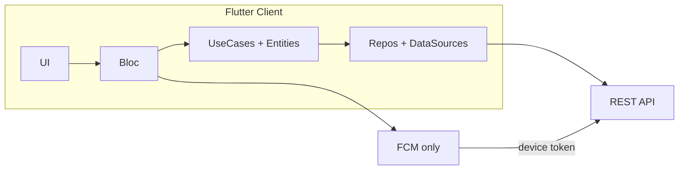

# 00 — نظرة عامة والمراحل

## الهدف

توحيد رؤية الفريق لتحويل **نبض اليمن** من Firebase إلى REST API مع الحفاظ على تجربة المستخدم قدر الإمكان، وتحسين المعمارية (Bloc، فصل data sources، تخزين آمن).

## الوضع الحالي (ملخص)

| المكوّن | التقنية الحالية | الملفات الرئيسية |
|---------|-----------------|------------------|
| مصادقة | Firebase Auth + Firestore `donors`/`centers` | `lib/data/repositories/auth_repo_impl.dart` |
| بحث | Firestore queries | `lib/data/repositories/search_repo_impl.dart` |
| ملف شخصي | Firestore + Hive | `profile_repository_impl.dart`, `donor_hive_data.dart` |
| بيانات عامة | Firestore `global_app_data` + Storage URLs | `global_repo_impl.dart` |
| إشعارات | FCM token + HTTP FCM قديم | `send_notfication_impl.dart`, cubits |
| حالة UI | **Cubit** (7) | `lib/presentation/cubit/**` |
| DI | GetIt | `lib/di.dart` |

## الوضع المستهدف

- **كل البيانات والوسائط** عبر API (`/files/upload` للصور).
- **FCM فقط** من عائلة Firebase (`firebase_core`, `firebase_messaging`).
- **لا Admin** في التطبيق في هذه المرحلة.

## خريطة المراحل

| المرحلة | المجلد | مخرجات تنفيذية |
|---------|--------|----------------|
| 0 | `المرحلة-0-الأساس` | Dio + تخزين + DI + env |
| 1 | `المرحلة-1-المصادقة` | AuthBloc، جلسة، OTP |
| 2 | `المرحلة-2-المتبرع` | ProfileBloc، SearchBloc |
| 3 | `المرحلة-3-المركز` | CenterBloc، stock |
| 4 | `المرحلة-4-المحتوى-والإشعارات` | AppConfigBloc، NotificationsBloc |
| 5 | `المرحلة-5-الميزات-الجديدة` | BloodRequestBloc |
| 6 | `المرحلة-6-الإغلاق` | مراجعة نهائية + QA (لا بقايا Cubit/Firestore) |

## مبدأ التنفيذ

1. **تسلسل عمودي:** المرحلة 1 (Auth) شرط لمعظم ما بعدها؛ لا تبدأ 2–4 قبل جلسة API عاملة.
2. **استبدال فوري لكل ميزة:** عند دمج `AuthBloc` احذف `signin_cubit`/`signup_cubit` في نفس PR — لا تترك Cubit حتى المرحلة 6.
3. **الهجرة أولاً، الميزات ثانياً:** طلبات الدم (10) بعد استقرار 1–4.
4. **مستخدمون قدامى:** عند `403` + `NEEDS_FIREBASE_PASSWORD` وجّه لمسار **نسيت كلمة المرور** (بدون Firebase في العميل).
5. **تغيير breaking — التسجيل:** التطبيق الحالي يستخدم **OTP هاتف Firebase** عند التسجيل؛ الـ API يستخدم **هاتف + كلمة مرور** (`POST /auth/register`) — يتطلب إعادة تصميم `sign_up_page` (انظر 04).

## قراءة مبكرة لإصدار التطبيق (موصى بها)

قبل إكمال المرحلة 4، استدعِ `GET /app-config` (أو مفتاح `min_app_version`) من **Splash** لاستبدال `lib/core/update.dart` (Firestore `updating`) — يمكن تنفيذها كجزء من مرحلة 0/1 عبر `AppConfigRepository` خفيف.

## جدول تحويل Firebase → API (مرجع سريع)

| Firebase | API البديل |
|----------|------------|
| `FirebaseAuth.signInWithEmailAndPassword` | `POST /auth/login` |
| `FirebaseAuth.createUserWithEmailAndPassword` | `POST /auth/register` (DONOR) |
| مستند `donors/{uid}` | `GET/PATCH /donors/me` |
| مستند `centers/{uid}` | `GET/PATCH /centers/me` |
| بحث Firestore | `GET /donor-search` |
| `global_app_data` | `GET /app-config` |
| Storage download URL | `GET /files/:fileId` أو URL عام |
| `updating` collection | `GET /app-config` → حقل `min_app_version` (+ مفاتيح إضافية حسب السيرفر) |
| `FirebaseAuth.verifyPhoneNumber` (تسجيل) | `POST /auth/register` + كلمة مرور — **لا OTP تسجيل في API** |
| FCM token في Firestore | `POST /auth/device` |
| إرسال إشعار HTTP قديم | السيرفر يرسل FCM — العميل يستقبل فقط |

## معايير قبول (مرحلة 0 ككل)

- [ ] فريق يفهم ترتيب المراحل ويوافق على عدم Admin.
- [ ] بيئة dev/prod معرّفة لـ base URL.
- [ ] هيكل مجلدات `lib/data/datasources` مقرر (انظر 03).

## مخاطر

| الخطر | التخفيف |
|-------|---------|
| انقطاع لمستخدمي الإنتاج | OTP + إعلان داخل التطبيق قبل إجبار التحديث |
| ازدواجية Cubit/Bloc | حذف Cubit القديم في **نفس مرحلة** إدخال Bloc؛ المرحلة 11 مراجعة فقط |
| فشل تطابق محافظات API مع `country.json` | Drift + API مصدر الحقيقة؛ استبدال `csc_picker` (انظر 06) |
| اختلاف حقول Firestore عن API | جدول mapping في كل ملف مرحلة |

## الملفات التالية

1. [01-طبقة-الشبكة-والجلسة.md](01-طبقة-الشبكة-والجلسة.md)
2. [02-التخزين-المحلي.md](02-التخزين-المحلي.md)
3. [03-التهيئة-di-والمنصات.md](03-التهيئة-di-والمنصات.md)
