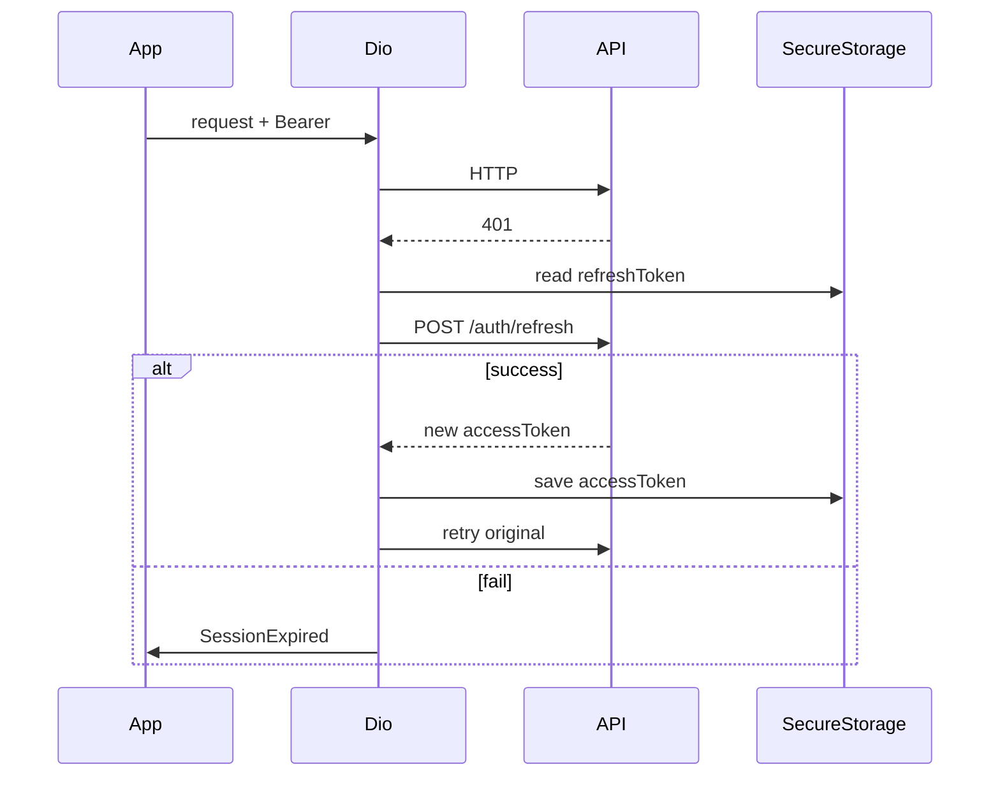

# 01 — طبقة الشبكة والجلسة

## الهدف

بناء عميل HTTP موحّد يتعامل مع JWT و`x-device-id` وإعادة المحاولة عند 401.

## الوضع الحالي

- لا يوجد عميل REST مركزي؛ `AppConstants.baseUrl` يشير إلى FCM HTTP القديم (`lib/core/app_constants.dart`).
- `NetworkInfo` موجود (`lib/core/network/network_info.dart`) لكن مرتبط بـ repositories Firebase.
- لا interceptor لـ refresh token.

## API المرجعي

راجع: [`docs/backend_guide/client-integration.md`](../../backend_guide/client-integration.md)

| العنصر | القيمة |
|--------|--------|
| Header جلسة | `Authorization: Bearer <accessToken>` |
| Header جهاز | `x-device-id: <uuid ثابت لكل تثبيت>` |
| Refresh | `POST /auth/refresh` — **201** → `{ "accessToken" }` (لا يُعاد refresh جديد) |
| نجاح login/register | **201** (ليس 200) — عالج في parser |
| 401 | refresh مرة → إعادة الطلب؛ فشل → logout |

## التصميم المقترح

### هيكل ملفات (إنشاء)

```text
lib/core/network/
  api_client.dart              # واجهة abstract
  dio_api_client.dart          # تنفيذ Dio
  api_endpoints.dart           # مسارات نسبية
  auth_interceptor.dart        # إرفاق token + refresh
  device_id_interceptor.dart   # x-device-id
  api_exception_mapper.dart    # JSON error → Failure

lib/core/config/
  app_config.dart              # baseUrl من dart-define
```

### `AppConfig` (env)

```dart
// مثال — لا ينسخ حرفياً دون مراجعة
static const apiBaseUrl = String.fromEnvironment(
  'API_BASE_URL',
  defaultValue: 'https://nabdh.telqaia.com/api/v1',
);
```

تشغيل محلي:

```bash
flutter run --dart-define=API_BASE_URL=http://10.0.2.2:3000/api/v1
```

(استخدم `10.0.2.2` للمحاكي Android بدل `localhost`.)

### Interceptor — تدفق 401



### قواعد Interceptor (تجنب أخطاء شائعة)

1. **لا refresh على:** `POST /auth/refresh`, `POST /auth/login`, `POST /auth/register` — عند 401 هنا → `SessionExpired` مباشرة.
2. **طلب واحد للـ refresh:** `_isRefreshing` + queue؛ تجنّب عدة refresh متوازية.
3. **ترتيب logout:** استدعِ `POST /auth/logout` **قبل** مسح tokens (يحتاج JWT + body).
4. **Throttling 429:** اقرأ `Retry-After` إن وُجد أو backoff بسيط في UI.

### معالجة الأخطاء

Body قياسي:

```json
{ "statusCode": 403, "message": "...", "error": "Forbidden", "code": "..." }
```

وسّع `lib/core/error/failures.dart`:

| Failure | متى |
|---------|-----|
| `UnauthorizedFailure` | 401 بعد فشل refresh |
| `ForbiddenFailure` | 403 (بما فيها `BLOCKED`, `NEEDS_FIREBASE_PASSWORD`) |
| `ValidationFailure` | 400 |
| `ThrottledFailure` | 429 |
| `ServerFailure` | 5xx |
| `NetworkFailure` | timeout / no connection |

استخدم `getFailureMessage()` للعربية في UI.

## الملفات — إنشاء / تعديل / حذف

| إجراء | مسار |
|-------|------|
| إنشاء | `lib/core/network/*` أعلاه |
| إنشاء | `lib/core/config/app_config.dart` |
| تعديل | `lib/core/error/failures.dart` |
| تعديل | `pubspec.yaml` — إضافة `dio` |
| حذف لاحقاً | استخدام `AppConstants.baseUrl` لـ FCM القديم (مرحلة 9) |

## معايير قبول

- [ ] طلب `GET /health` ينجح على prod و local.
- [ ] طلب محمي بدون token → 401 → refresh → إعادة ناجحة.
- [ ] refresh فاشل → مسح tokens + حدث `SessionExpired` للـ AuthBloc.
- [ ] كل طلب يحمل `x-device-id` ثابتاً بعد أول تشغيل.
- [ ] لا استيراد Firebase في `core/network`.

## مخاطر

| الخطر | التخفيف |
|-------|---------|
| حلقة refresh لا نهائية | flag `_isRefreshing` + queue للطلبات المعلّقة |
| تسريب token في logs | تعطيل `LogInterceptor` body في release |

## التبعيات

- يتطلب: [02-التخزين-المحلي.md](02-التخزين-المحلي.md) لحفظ tokens.
- يُستخدم في: كل المراحل 1–6.
